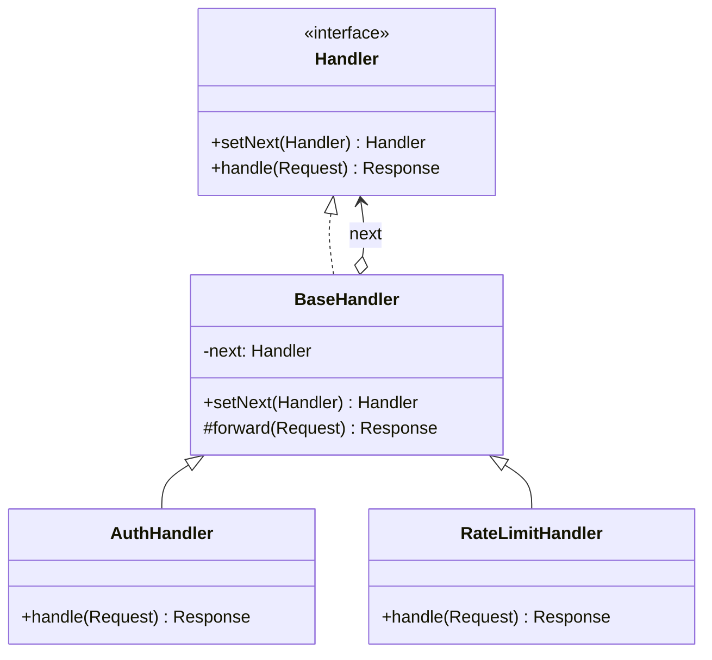

# Chain of Responsibility

**Chain of Responsibility** is a behavioral design pattern that lets you pass requests along a chain of handlers. Upon
receiving a request, each handler decides either to process the request or to pass it to the next handler in the chain.

## Problem

A request has to clear a series of checks before anything real happens: is the caller authenticated, are they within
their quota, is the payload a sane size. Written inline, those checks pile up at the top of one function, tangle
together, and cannot be reordered or reused elsewhere without copying them.

Chain of Responsibility makes each check a standalone object that either rejects the request or passes it on. The chain
is assembled at wiring time, so checks can be added, removed or reordered without any of them knowing about the others.

## Structure



## How to Implement

- Declare the handler interface: a method to process the request, and a method to link the next handler.
- Put the "next" pointer and the pass-along logic in a base class so concrete handlers only write their own check.
- Each handler decides for itself whether to handle the request, pass it on, or stop the chain by rejecting it.
- Decide what happens when the request runs off the end of the chain without anyone answering it.
- Assemble the chain in the client. The order is a real decision — it determines which rejection wins.
- The client should be able to hand a request to any link, not just the head.

# Real World Example

HTTP middleware, which is this pattern in everyday use.

[`chain.go`](go/chain.go) links an auth check, a per-client rate limiter, a body-size limit, an audit recorder, and a
terminal handler that answers. Each link can stop the chain: a bad token never reaches the rate limiter, so the audit
recorder never sees it either.

The tests make the ordering point explicit — the same oversized request with a bad token returns `401` when auth comes
first and `413` when the size check does, without either handler changing.

```bash
docker run --rm -v "$PWD:/app" -w /app golang:1.23-alpine go test ./Behavioral/ChainOfResponsibility/go/...
```
