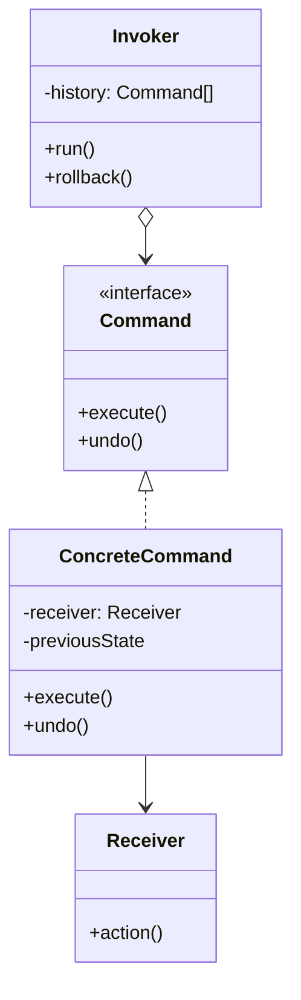

# Command

**Command** is a behavioral design pattern that turns a request into a stand-alone object containing all information
about the request. This lets you pass requests as method arguments, delay or queue their execution, and support
undoable operations.

## Problem

Code that performs an operation usually calls it directly, which means the operation cannot be stored, queued, retried,
logged uniformly, or reversed. The moment you need "undo", or "run this later", or "roll back everything applied so
far", a direct call gives you nothing to hold on to.

Command wraps the request — receiver, method, and arguments — in an object. Once an operation is a value, you can put it
in a list, hand it to a worker, keep a history of it, or ask it to reverse itself.

## Structure



## How to Implement

- Declare the command interface with a single execution method — and an `undo` method if reversal is required.
- Extract each request into its own class implementing that interface. Each one stores a reference to its receiver plus
  whatever arguments the operation needs.
- For undo, have `execute` record the state it is about to overwrite. Restore *that* value, not a hard-coded default —
  this is the detail that quietly breaks most undo implementations.
- Make the invoker hold commands and trigger them. It should know only the interface, never a concrete command.
- Have the client build the commands, wire them to their receivers, and hand them to the invoker.

# Real World Example

A release. Scale a service, flip a feature flag, run a migration — and if step four fails, everything already applied
has to come back off, in reverse order.

[`Release`](go/command.go) is the invoker. It applies commands in order, and on failure walks its history backwards
calling `Undo`. Because each command captured the value it replaced, the rollback restores the state that was actually
there before — a flag that was already on stays on. The original error is returned rather than any cleanup error, so the
operator sees the real cause.

```bash
docker run --rm -v "$PWD:/app" -w /app golang:1.23-alpine go test ./Behavioral/Command/go/...
```
