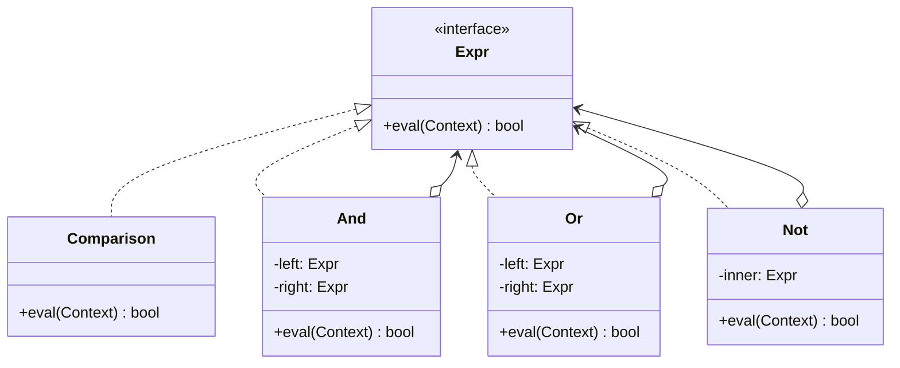

# Interpreter

**Interpreter** is a behavioral design pattern that defines a representation for a language's grammar along with an
interpreter that uses the representation to interpret sentences in that language.

> Interpreter is not in the original GoF *Behavioral* chapter list people usually memorise, but it is one of the eleven.
> It is the rarest of them in day-to-day code — and unmistakable once you need it.

## Problem

A recurring problem keeps arriving as text: segmentation rules, log filters, permission expressions, pricing conditions.
Hard-coding each variant means a release for every new rule, and business users cannot express what they want without a
developer.

Interpreter defines a small grammar, gives every construct in it a class, and gives every class an `interpret` method.
Parsing turns the text into a tree of those objects; evaluating the tree answers the question.

## Structure



## How to Implement

- Write the grammar down first, lowest-precedence rule first. The parser's shape follows directly from it.
- Give every rule a class. Terminal expressions (a literal, a comparison) do the actual work; non-terminal expressions
  (AND, OR, NOT) hold child expressions and combine their results.
- Declare a common interface with the `interpret`/`eval` method, taking whatever context the evaluation needs.
- Build the tree with a parser. Recursive descent maps one function per grammar rule and is usually enough.
- Separate parse errors from evaluation errors — the user needs to know whether they mistyped the rule or referenced a
  field that does not exist.

# Real World Example

Customer segmentation. Support wants to target users with rules like:

```text
plan = "pro" AND (seats > 10 OR trial = false)
```

without a release for every new segment.

[`interpreter.go`](go/interpreter.go) contains a lexer, a recursive-descent parser, and four expression types. `AND` and
`OR` short-circuit, so a cheap term can guard an expensive or error-prone one. Errors are separated into `ErrSyntax`,
`ErrUnknownField` and `ErrTypeMismatch`, so the UI can tell the user which mistake they made.

A parsed rule is a reusable value: parse once, evaluate against thousands of customers. `String()` re-renders the tree
with its precedence made explicit, which is how you show an admin that `a AND b OR c` was read as `(a AND b) OR c`.

```bash
docker run --rm -v "$PWD:/app" -w /app golang:1.23-alpine go test ./Behavioral/Interpreter/go/...
```
