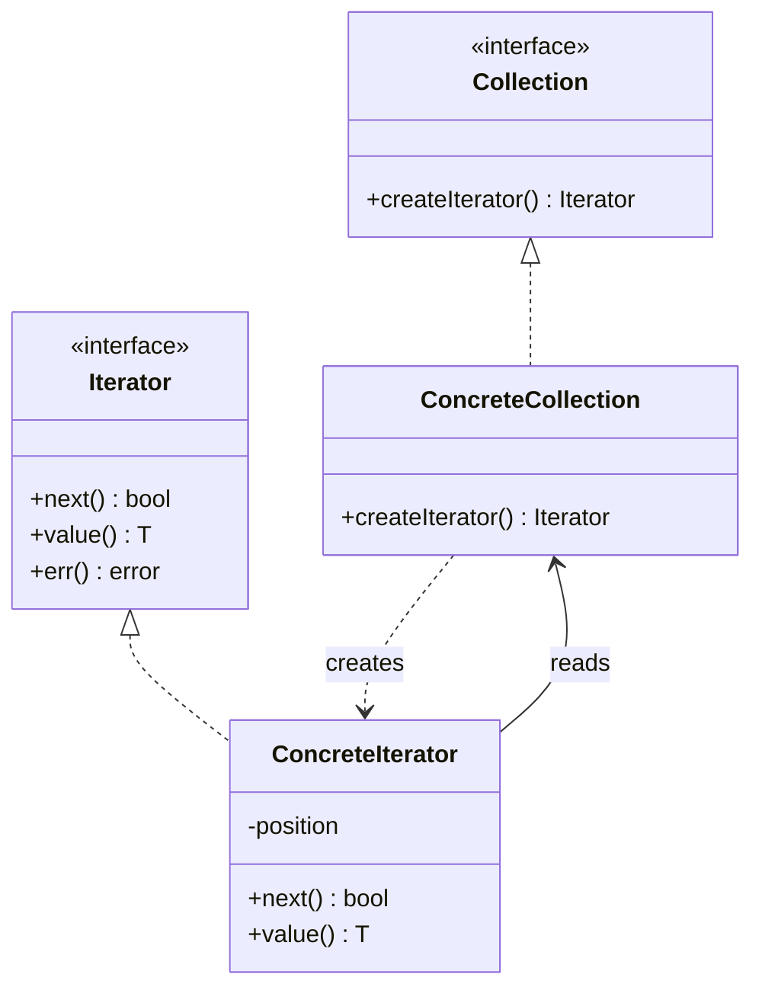

# Iterator

**Iterator** is a behavioral design pattern that lets you traverse elements of a collection without exposing its
underlying representation (list, stack, tree, etc.).

## Problem

Collections differ wildly on the inside — a slice, a tree, a paginated remote API — but client code almost always wants
the same thing: visit every element once. If traversal lives in the client, the client learns the internals, and the
collection can never change shape again. If the collection grows a traversal method per strategy, it stops being a
collection and becomes a grab bag.

Iterator moves traversal into its own object that holds the position and knows how to advance.

## Structure



## How to Implement

- Declare the iterator interface. At minimum: advance, read the current element, and report whether traversal ended.
- If fetching can fail, expose the error separately — do not let "finished" and "failed" look the same to the caller.
- Write a concrete iterator holding the traversal position. Each iterator must be independent of the others.
- Give the collection a way to create iterators over itself.
- Replace traversal code in the client with the iterator. The client should no longer touch the collection's internals.

# Real World Example

A paginated REST API. Results come back one page at a time behind an opaque cursor, but the calling code just wants
"every user".

[`Cursor`](go/iterator.go) holds the paging state and fetches the next page only when the current one runs out — the
tests assert this by counting upstream calls. It also handles the awkward cases a real API produces: an empty page in
the middle of a feed does not end iteration, and a mid-traversal failure stops cleanly, keeps the items already
retrieved, and is reported through `Err()` rather than being mistaken for exhaustion.

`All()` adapts it to Go 1.23 range-over-func, so callers can write `for u := range cursor.All()` — and breaking out of
that loop stops fetching.

```bash
docker run --rm -v "$PWD:/app" -w /app golang:1.23-alpine go test ./Behavioral/Iterator/go/...
```
