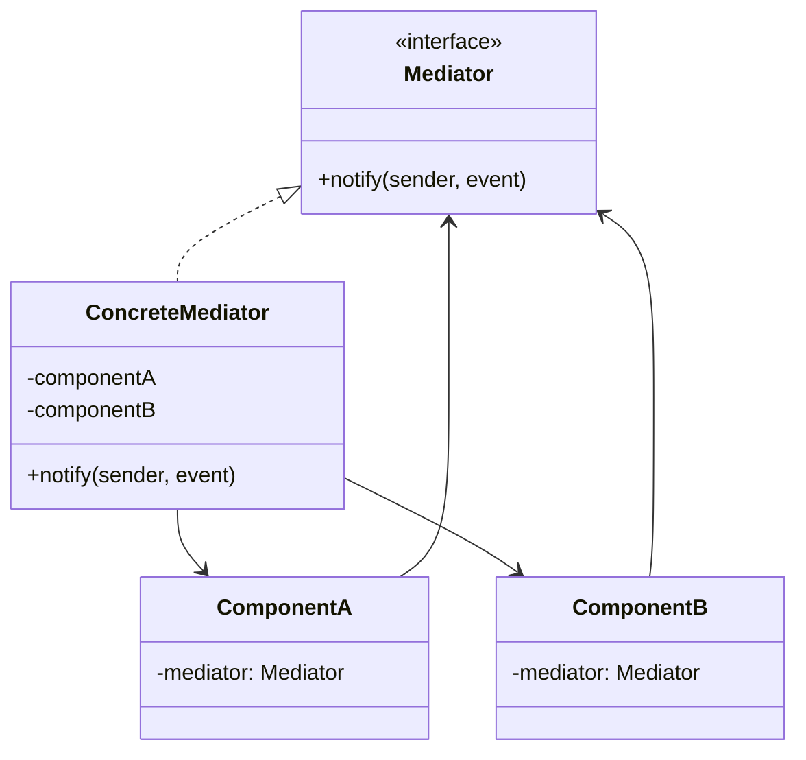

# Mediator

**Mediator** is a behavioral design pattern that lets you reduce chaotic dependencies between objects. The pattern
restricts direct communications between the objects and forces them to collaborate only via a mediator object.

## Problem

A handful of components each call each other directly. Payments knows about shipping, shipping knows about
notifications, inventory knows about all of them. The result is a mesh: none of the components can be tested, reused or
changed alone, because each one drags the others in behind it.

Mediator puts a single object in the middle. Components report what happened to it and it decides what happens next, so
they never reference each other.

## Structure



## How to Implement

- Find the group of tightly coupled classes that would be easier to change independently.
- Declare the mediator interface. A single `notify(sender, event)` method keeps components from needing per-component
  methods.
- Implement the concrete mediator. It usually holds every component, and it is the only place the workflow is written
  down.
- Give components a reference to the mediator, established at construction.
- Replace every direct call between components with a notification to the mediator.

> The mediator gets big — that is the trade. You are concentrating complexity in one reviewable place instead of
> spreading it across a mesh. If it grows past comprehension, that is the signal to split the workflow, not to go back
> to direct calls.

# Real World Example

Checkout as a saga. Reserve stock, take payment, dispatch, notify — and unwind correctly when any step fails.

In [`mediator.go`](go/mediator.go), `Checkout` is the only thing that knows the order of the steps and what compensation
each failure requires. A declined card releases the stock; a failed dispatch refunds *and* releases. `Inventory` never
mentions `Payments`.

One subtlety the tests caught: because a late failure travels back up through the notification cascade, every level
would otherwise run its own rollback and send its own email. The `failed` guard ensures only the innermost failure — the
one that actually knows what went wrong — compensates.

```bash
docker run --rm -v "$PWD:/app" -w /app golang:1.23-alpine go test ./Behavioral/Mediator/go/...
```
