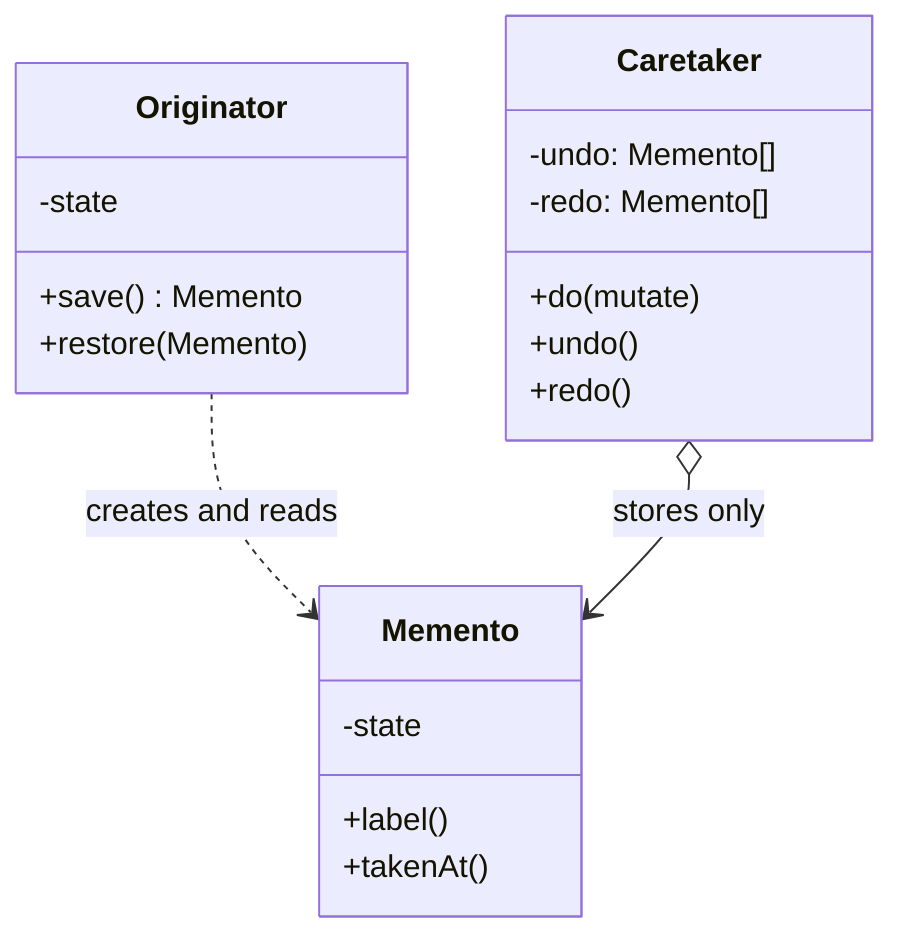

# Memento

**Memento** is a behavioral design pattern that lets you save and restore the previous state of an object without
revealing the details of its implementation.

## Problem

To implement undo, something has to record the object's state before each change. The obvious approach — let the history
object reach in and copy the fields — forces the object to make its internals public, and then every field added later
is a bug waiting to happen, because the history will silently fail to save it.

Memento reverses the direction. The object produces a snapshot of itself, and it is the only thing that can read one
back. The history stores snapshots it cannot open.

## Structure



## How to Implement

- Decide which class is the originator — the one whose state must be restorable.
- Create the memento type. Its state must be readable by the originator and by nobody else.
- Give the originator a method that produces a memento, and one that accepts a memento back.
- **Copy, do not reference.** If the snapshot shares a slice or map with the live object, a later edit mutates the
  snapshot too and undo becomes a silent no-op. Copy on the way in *and* on the way out.
- Have the caretaker store the mementos and decide when to restore them. It should be able to see metadata — a label, a
  timestamp — and nothing else.
- Cap the history. Unbounded undo is a memory leak in any long-lived editor.

# Real World Example

A document editor with undo and redo.

[`Memento`](go/memento.go) has entirely unexported state, so only `Document` can read it; the caretaker can reach
`Label()` and `TakenAt()`, which is exactly enough to build an "Undo: rename title" menu entry and no more.

`History` snapshots *before* applying each change, which is what makes it reversible, and clears the redo branch on a
fresh edit — standard editor behaviour. The copy-don't-reference rule has its own tests in both directions, since that
is where this pattern usually goes wrong in practice.

```bash
docker run --rm -v "$PWD:/app" -w /app golang:1.23-alpine go test ./Behavioral/Memento/go/...
```
