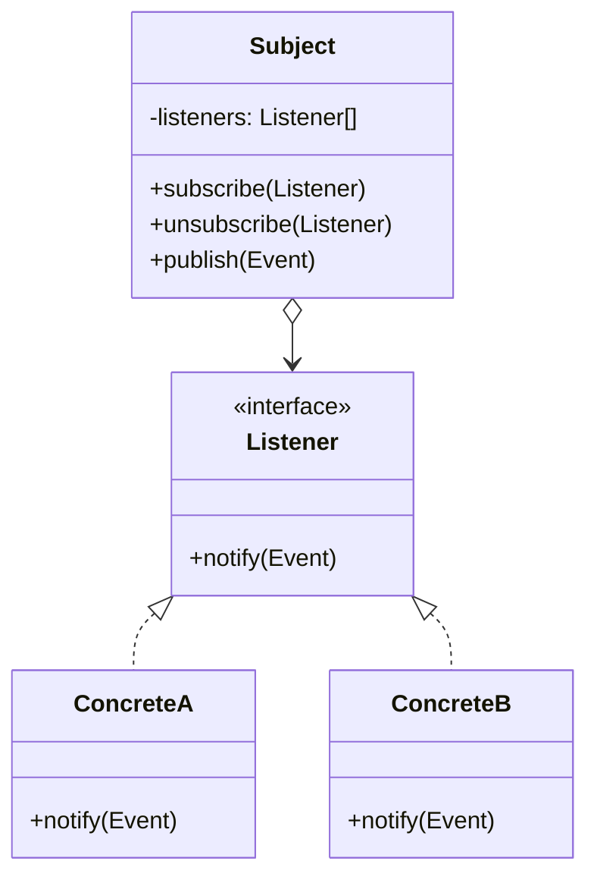

# Observer

**Observer** is a behavioral design pattern that lets you define a subscription mechanism to notify multiple objects
about any events that happen to the object they're observing.

## Problem

Something interesting happens in one object, and a growing list of unrelated objects need to know about it. If the
publisher calls each of them directly it has to import all of them, and every new consumer means editing the publisher —
even though nothing about the publisher's own job changed.

The alternative, having everyone poll for changes, wastes work and still couples the pollers to the publisher's shape.
Observer lets interested parties register themselves, so the publisher only knows it has *some* subscribers.

## Structure



## How to Implement

- Split the code in two: the publisher, which owns the state worth reporting, and the subscribers, which react to it.
- Declare the subscriber interface. Usually a single `notify` method taking the event is enough.
- Declare the subscription methods on the publisher, and store subscribers in a collection.
- Have the publisher walk that collection whenever the event occurs. It must not know any concrete subscriber type.
- Give subscribers a way to *unsubscribe*. This is the step most often forgotten, and it is how observer implementations
  leak memory.
- Decide what happens when one subscriber fails: in most systems the rest must still run.

# Real World Example

Checkout. When an order is paid, several unrelated things must happen — email the customer, decrement stock, write an
audit record. Checkout should not hold that list.

[`Dispatcher`](go/observer.go) is the subject. Two production details are worth noting: `Subscribe` returns the
*unsubscribe closure*, so a caller cannot leak a subscription by losing its reference; and `Publish` calls listeners
outside the lock, so a listener may subscribe or unsubscribe during delivery without deadlocking. One failing listener
does not stop the others — the errors are collected and returned together.

```bash
docker run --rm -v "$PWD:/app" -w /app golang:1.23-alpine go test ./Behavioral/Observer/go/...
```

This is the one pattern here with real concurrency, so it is worth running under the race detector. That needs cgo, which
the alpine image does not ship — use the full image:

```bash
docker run --rm -v "$PWD:/app" -w /app golang:1.23 go test -race ./Behavioral/Observer/go/...
```
