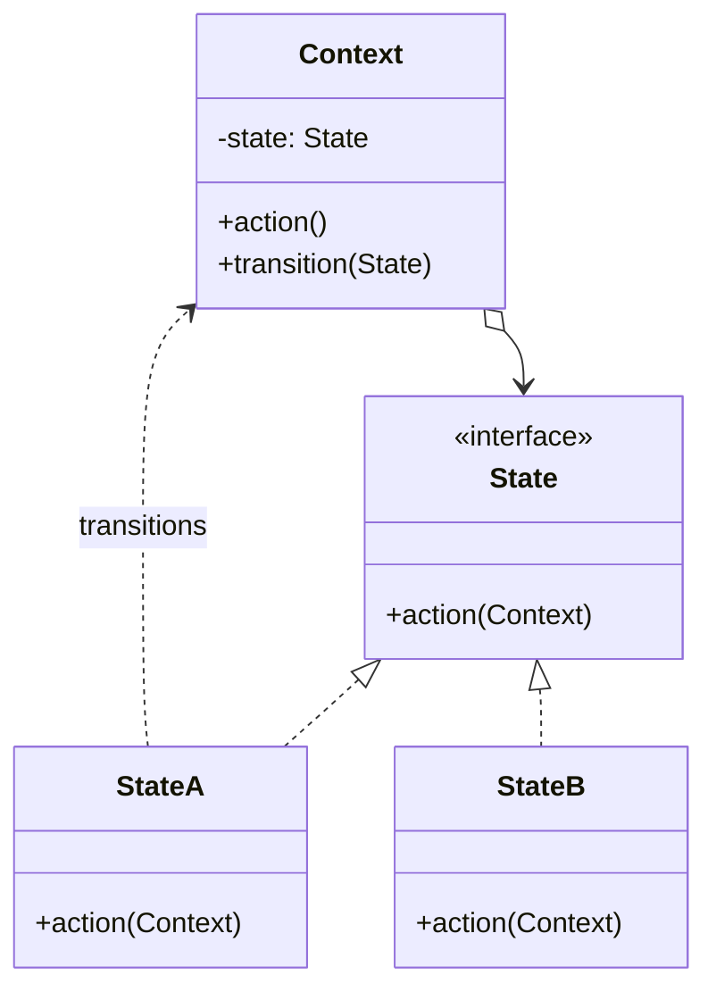

# State

**State** is a behavioral design pattern that lets an object alter its behavior when its internal state changes. It
appears as if the object changed its class.

## Problem

An object behaves differently depending on which stage of its life it is in, and the rules are enforced with a status
field and conditionals. Every method starts with the same `switch`, the branches drift apart, and adding a stage means
finding and editing all of them. Worse, nothing stops an illegal transition — it just falls through to a branch nobody
thought about.

State gives each stage its own type implementing a shared interface. The rules for a stage live in one place, and the
object delegates to whichever state it is currently holding.

## Structure



## How to Implement

- Decide which class is the context — the one whose behaviour depends on its stage.
- Declare the state interface, with one method per action the context supports.
- Create a class per stage. Move the matching branch of each conditional into it.
- Give the context a field holding the current state, and have every action delegate to it.
- Let states trigger transitions by handing the context its replacement.
- Provide a base state that refuses every action, and have each concrete state override only what it permits. Then a
  newly added action defaults to "not allowed" rather than silently succeeding everywhere.

# Real World Example

An order lifecycle. You can cancel a pending order but not a delivered one; you can only ship what has been paid for;
once it is with the courier, cancelling is no longer your call.

In [`state.go`](go/state.go) each stage is a type embedding `base`, which refuses everything and reports
`ErrInvalidTransition`. `pendingState` overrides `Pay` and `Cancel`; `shippedState` overrides only `Deliver`; delivered
and cancelled override nothing at all, because they are terminal. Notice there is not a single `switch` in `Order`.

Validation and transition legality are kept distinct — shipping without a tracking number fails, but it is not an
invalid transition, and the tests assert the difference.

```bash
docker run --rm -v "$PWD:/app" -w /app golang:1.23-alpine go test ./Behavioral/State/go/...
```
