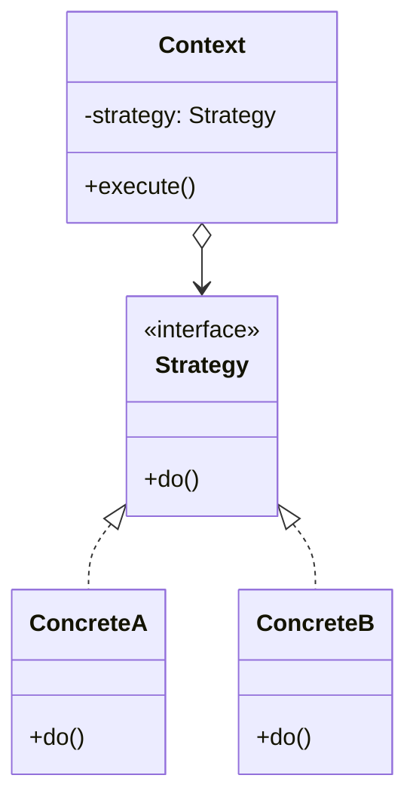

# Strategy

**Strategy** is a behavioral design pattern that lets you define a family of algorithms, put each of them into a
separate class, and make their objects interchangeable.

## Problem

A class grows a method that does one job several different ways, selected by a flag or a chain of `if`s. Every new
variant means editing that method again, the conditionals multiply, and the class ends up owning algorithms that have
nothing to do with its real responsibility. Merge conflicts follow, because everyone is editing the same block.

Strategy extracts each variant into its own type behind a shared interface. The original class keeps a reference to one
of them and delegates, so adding a variant means adding a file — not touching working code.

## Structure



## How to Implement

- In the context class, identify the algorithm that changes between variants, or that is likely to change at runtime.
- Declare the strategy interface with the single operation the context needs. Keep it narrow — the context should not
  know anything about how the work is done.
- Extract each variant into its own class implementing that interface.
- In the context, add a field holding a strategy and delegate to it instead of branching. The context must not know
  which concrete strategy it holds.
- Let the client choose and inject the strategy. The context should never construct one itself.

# Real World Example

Retries. Every service that crosses a network boundary needs to wait between attempts, but the right waiting policy is
different in each case: an internal health check wants a short constant delay, a payment gateway wants exponential
backoff, and a shared third-party API wants jitter so a fleet of clients does not retry in lockstep and stampede it.

[`Retrier`](go/strategy.go) owns the retry loop — count attempts, stop on success, respect context cancellation — and
delegates only the timing to a `Backoff`. `JitteredBackoff` is worth a look: it is a strategy that *wraps another
strategy*, which is only possible because the context depends on the interface rather than any concrete type.

```bash
docker run --rm -v "$PWD:/app" -w /app golang:1.23-alpine go test ./Behavioral/Strategy/go/...
```
