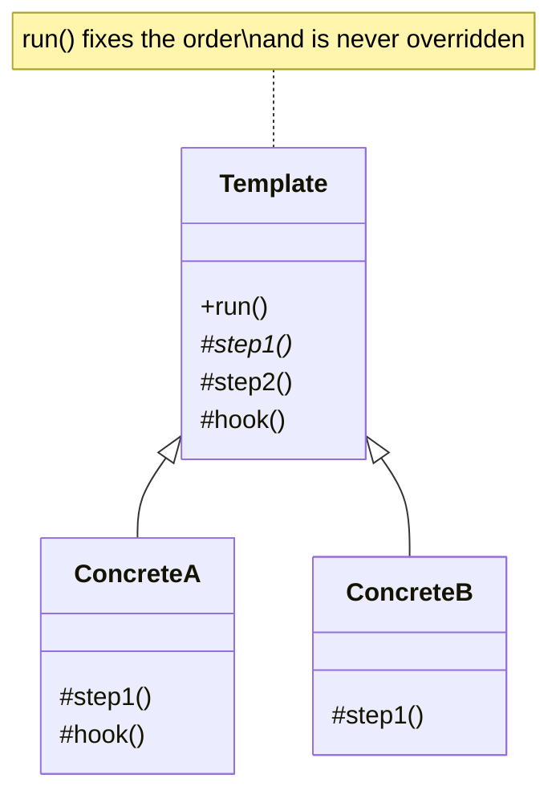

# Template Method

**Template Method** is a behavioral design pattern that defines the skeleton of an algorithm in the superclass but lets
subclasses override specific steps of the algorithm without changing its structure.

## Problem

Several classes do the same job in the same order, differing in only one or two steps. Copy-pasting the skeleton means
every fix has to be applied everywhere, and the versions drift until nobody is sure which one is right.

Template Method writes the sequence down once, in a place nobody can reorder, and leaves named holes for the parts that
genuinely differ.

## Structure



## How to Implement

- Break the algorithm into steps and work out which are identical for everyone and which vary.
- Write the template method as a fixed sequence of calls to those steps. It should not be overridable.
- Make the genuinely varying steps abstract — every implementation must supply them.
- For steps that usually stay the same, provide a default and let implementations override optionally. These are hooks.
- Keep the ordering decisions in the template. If an implementation needs a different order, it does not belong here.

> Go has no inheritance, so the roles are played differently: required steps become an **interface** the implementation
> must satisfy, and optional hooks become **additional interfaces detected with a type assertion**. Not implementing a
> hook interface is the equivalent of not overriding a hook method.

# Real World Example

A nightly product-feed import. Every run does the same five things: reject an empty payload, parse, drop duplicates,
validate each row, load into the warehouse. Only parsing and the validation rules differ between the CSV feed and the
JSON feed.

[`Run`](go/templatemethod.go) is the template method and owns that order. `Importer` is the required step. `Validator`
and `Deduper` are optional hooks: `CSVImporter` implements both — it deduplicates and rejects zero prices — while
`JSONImporter` implements neither and gets the defaults. A malformed row is skipped and counted rather than aborting the
run, because one bad line should not lose the whole feed.

```bash
docker run --rm -v "$PWD:/app" -w /app golang:1.23-alpine go test ./Behavioral/TemplateMethod/go/...
```
