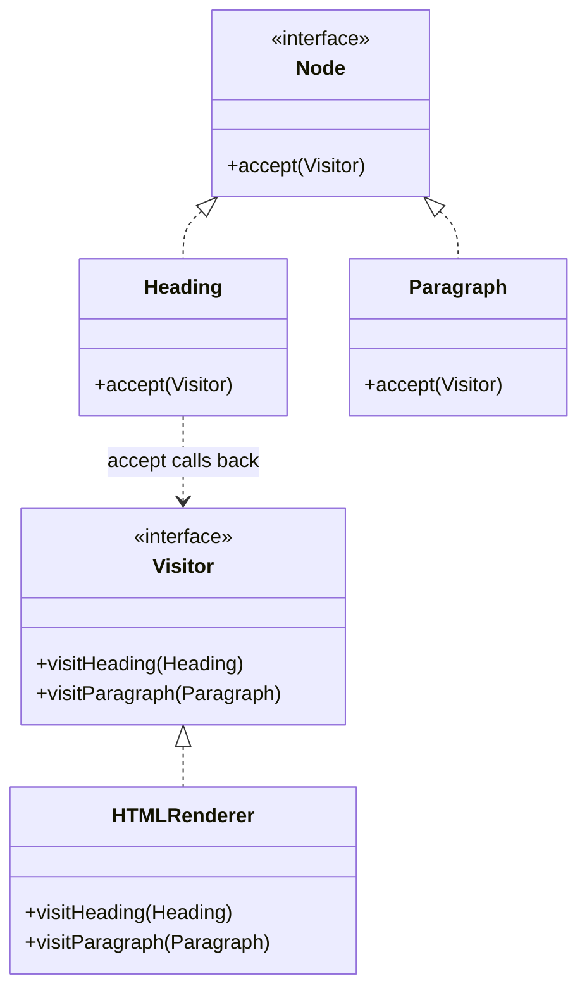

# Visitor

**Visitor** is a behavioral design pattern that lets you separate algorithms from the objects on which they operate.

## Problem

You have a stable set of node types — a document tree, an AST, a shape hierarchy — and a growing set of operations to
run over them. Adding each operation as a method means editing every node class every time, mixing exporting, indexing
and rendering concerns into types that should only describe structure.

Visitor turns the matrix around: each new operation is one new class, and the node types never change.

## Structure



## How to Implement

- Declare the visitor interface with one method per concrete node type.
- Declare the element interface with a single `accept(visitor)` method.
- Implement `accept` in every node as a one-liner calling the matching visitor method with `this`. This is the
  double-dispatch step: the node knows its own type, so it picks the right method.
- Write each operation as a visitor class. It gets access to the node's public data, so nodes may need to expose a
  little more than before.
- The client walks the structure, handing each node to the visitor.

> The trade-off is the mirror image of the problem: adding a new **operation** is cheap, adding a new **node type** is
> expensive because every visitor must be updated. Reach for Visitor only when the node types are stable.

# Real World Example

A CMS article stored as a tree of headings, paragraphs, lists and code blocks. It has to be rendered to HTML for the
web, to plain text for the email digest, and walked again to collect word counts and outbound links for the search
index.

[`visitor.go`](go/visitor.go) implements all three over the same nodes. Two details worth noting: `TextRenderer` simply
ignores code blocks — a visitor is free to do nothing for a node type — and `Stats` gathers word count, links and code
lines in a single pass, which was added without touching a single node type.

```bash
docker run --rm -v "$PWD:/app" -w /app golang:1.23-alpine go test ./Behavioral/Visitor/go/...
```
