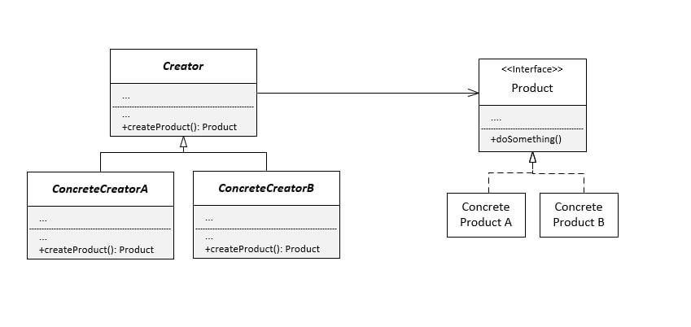
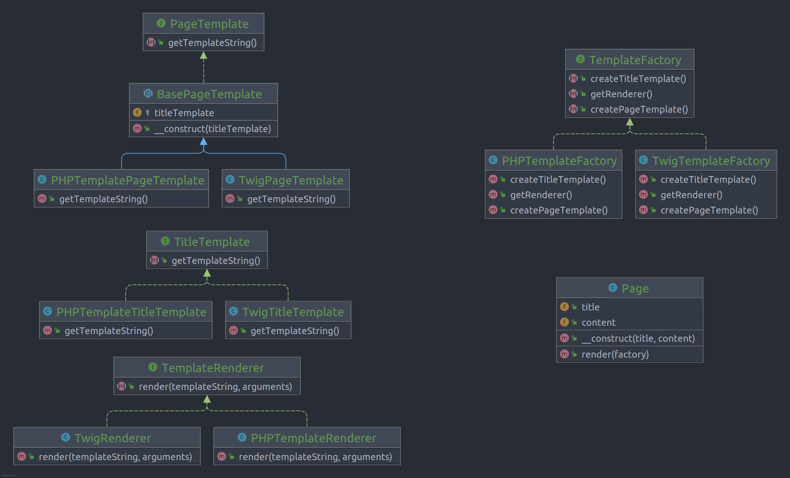

# Abstract Factory

**Abstract Factory** is a creational design pattern that lets you produce families of related objects without specifying
their concrete classes.

## Problem

Sometimes in our program we have product families and their variants that make it hard when we want to add more product
or variant. so in this situation we are going to use a factory pattern like abstract factory 

## Structure

## How to Implement

- Map out a matrix of distinct product types versus variants of these products.
- Declare abstract product interfaces for all product types. Then make all concrete product classes implement these
  interfaces.
- Declare the abstract factory interface with a set of creation methods for all abstract products.
- Implement a set of concrete factory classes, one for each product variant.
- Create factory initialization code somewhere in the app. It should instantiate one of the concrete factory classes,
  depending on the application configuration or the current environment. Pass this factory object to all classes that
  construct products.
- Scan through the code and find all direct calls to product constructors. Replace them with calls to the appropriate
  creation method on the factory object.

# Real World Example

In this example, the Factory Method pattern provides an interface for creating social network connectors, which can be
used to log in to the network, create posts and potentially perform other activities—and all of this without coupling
the client code to specific classes of the particular social network.

