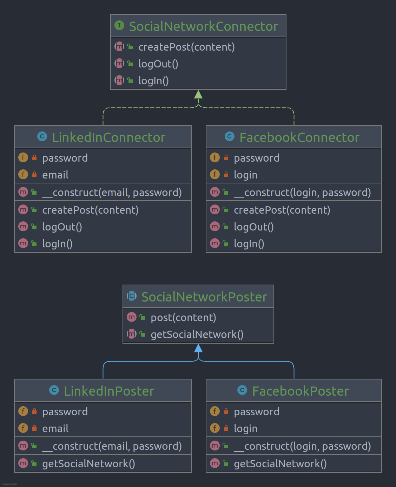

# Factory Method

Factory Method is a creational design pattern that provides an interface for creating objects in a superclass, but
allows subclasses to alter the type of objects that will be created.

## Problem

Adding a new class(product) to the program isn’t that simple if the rest of the code is already coupled to existing
classes. so sometime for extend usability of our programs we use this pattern

## Structure

## How to Implement

- Make all products follow the same interface. This interface should declare methods that make sense in every product.
- Add an empty factory method inside the creator class. The return type of the method should match the common product
  interface.
- In the creator’s code find all references to product constructors. One by one, replace them with calls to the factory
  method, while extracting the product creation code into the factory method.
- Now, create a set of creator subclasses for each type of product listed in the factory method. Override the factory
  method in the subclasses and extract the appropriate bits of construction code from the base method.
- If there are too many product types and, it doesn't make sense to create subclasses for all of them, you can reuse the
  control parameter from the base class in subclasses.
- If, after all the extractions, the base factory method has become empty, you can make it abstract. If there’s
  something left, you can make it a default behavior of the method.

# Real World Example

In this example, the Factory Method pattern provides an interface for creating social network connectors, which can be
used to log in to the network, create posts and potentially perform other activities—and all of this without coupling
the client code to specific classes of the particular social network.

