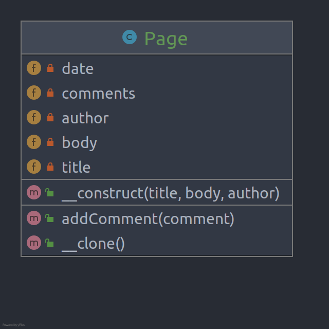

# Prototype

**Prototype** is a creational design pattern that lets you copy existing objects without making your code dependent on
their classes.

> The Prototype pattern is available in PHP out of the box. You can use the `clone` keyword to create an exact copy of an
object. To add cloning support to a class, you need to implement a `__clone` method.

## Problem

Copying an object “from the outside” isn’t always possible, because some of the object’s fields may be private and not
visible from outside the object itself.

## Structure

## How to Implement

- Create the prototype interface and declare the clone method in it. Or just add the method to all classes of an
  existing class hierarchy, if you have one.
- A prototype class must define the alternative constructor that accepts an object of that class as an argument. The
  constructor must copy the values of all fields defined in the class from the passed object into the newly created
  instance. If you’re changing a subclass, you must call the parent constructor to let the superclass handle the cloning
  of its private fields.
- If your programming language doesn’t support method overloading, you may define a special method for copying the
  object data. The constructor is a more convenient place to do this because it delivers the resulting object right
  after you call the new operator.
- The cloning method usually consists of just one line: running a new operator with the prototypical version of the
  constructor. Note, that every class must explicitly override the cloning method and use its own class name along with
  the new operator. Otherwise, the cloning method may produce an object of a parent class.
- Optionally, create a centralized prototype registry to store a catalog of frequently used prototypes.

# Real World Example

