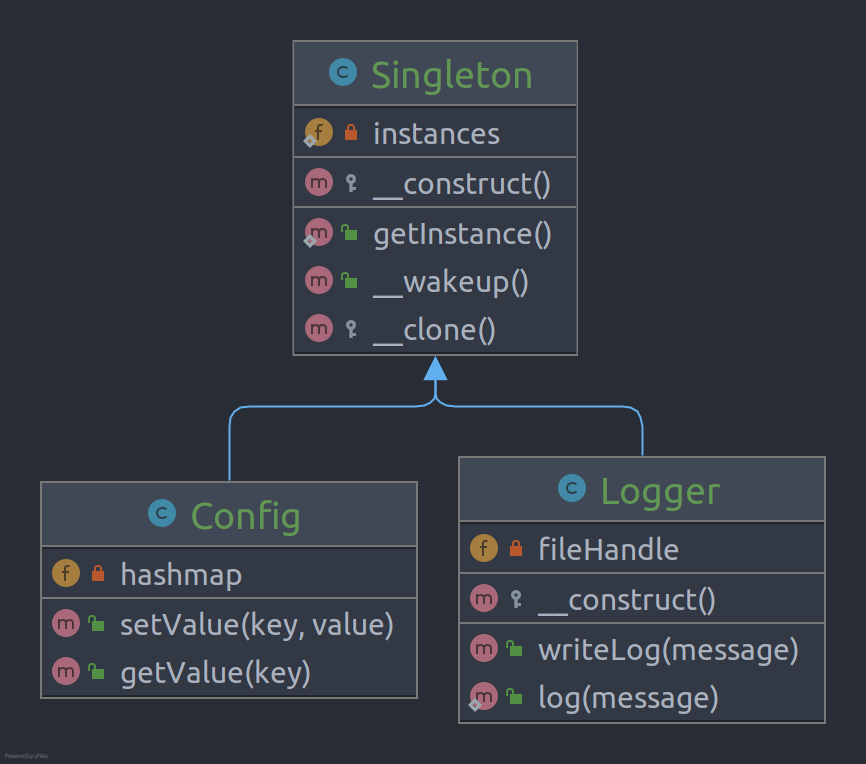

# Singleton

**Singleton** is a creational design pattern that lets you ensure that a class has only one instance, while providing a
global access point to this instance.

## Problem

This pattern at the same time ensure that a class has just a single instance and provide a global access point to that
instance.

## Structure

## How to Implement

- Add a private static field to the class for storing the singleton instance.
- Declare a public static creation method for getting the singleton instance.
- Implement “lazy initialization” inside the static method. It should create a new object on its first call and put it
  into the static field. The method should always return that instance on all subsequent calls.
- Make the constructor of the class private. The static method of the class will still be able to call the constructor,
  but not the other objects.
- Go over the client code and replace all direct calls to the singleton’s constructor with calls to its static creation
  method.

# Real World Example

The **Singleton** pattern is notorious for limiting code reuse and complicating unit testing. However, it’s still very
useful in some cases. In particular, it’s handy when you need to control some shared resources. For example, a global
logging object that has to control the access to a log file. Another good example: a shared runtime configuration
storage.

