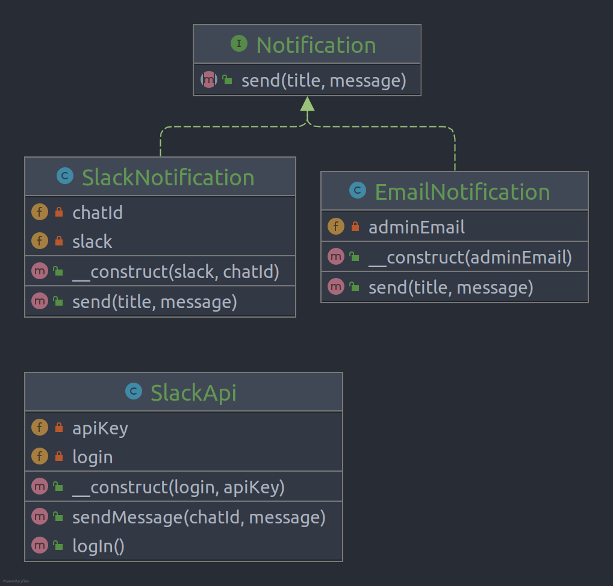

# Adapter

**Adapter** (Also known as: Wrapper) is a structural design pattern that allows objects with incompatible interfaces to
collaborate. The Adapter acts as a wrapper between two objects. It catches calls for one object and transforms them to
format and interface recognizable by the second object.

## Problem

sometimes we decide to improve the app by integrating a 3rd-party library, but maybe our class is not compatible with
that services, so we need adapt it 

## Structure

## How to Implement

- Make sure that you have at least two classes with incompatible interfaces:
- A useful service class, which you can’t change (often 3rd-party, legacy or with lots of existing dependencies). One or
  several client classes that would benefit from using the service class. Declare the client interface and describe how
  clients communicate with the service.
- Create the adapter class and make it follow the client interface. Leave all the methods empty for now.
- Add a field to the adapter class to store a reference to the service object. The common practice is to initialize this
  field via the constructor, but sometimes it’s more convenient to pass it to the adapter when calling its methods.
- One by one, implement all methods of the client interface in the adapter class. The adapter should delegate most of
  the real work to the service object, handling only the interface or data format conversion.
- Clients should use the adapter via the client interface. This will let you change or extend the adapters without
  affecting the client code.

# Real World Example

The Adapter pattern allows you to use 3rd-party or legacy classes even if they’re incompatible with the bulk of your
code. For example, instead of rewriting the notification interface of your app to support each 3rd-party service such as
Slack, Facebook, SMS, you can create a set of special wrappers that adapt calls from your app to an interface and format
required by each 3rd-party class.

