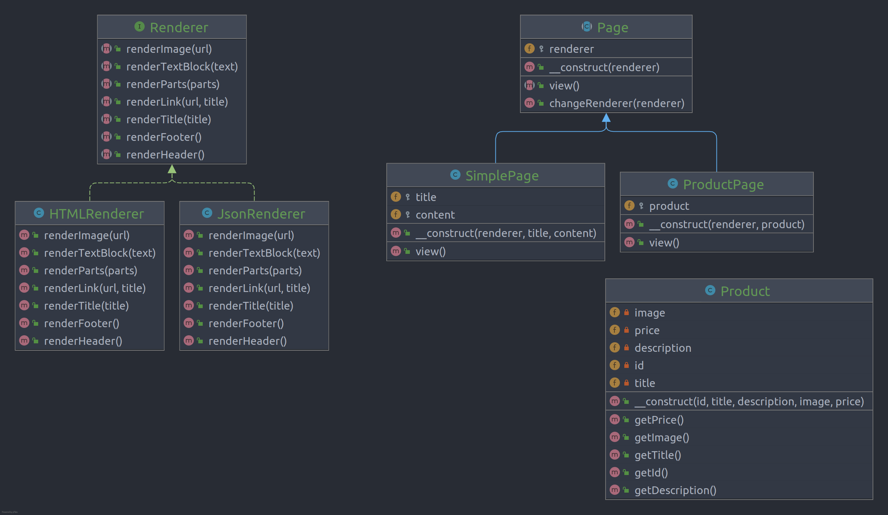

# Bridge

**Bridge** is a structural design pattern that lets you split a large class or a set of closely related classes into two
separate hierarchies—abstraction and implementation—which can be developed independently of each other.

## Problem

## Structure

## How to Implement

- Identify the orthogonal dimensions in your classes. These independent concepts could be: abstraction/platform,
  domain/infrastructure, front-end/back-end, or interface/implementation.
- See what operations the client needs and define them in the base abstraction class.
- Determine the operations available on all platforms. Declare the ones that the abstraction needs in the general
  implementation interface.
- For all platforms in your domain create concrete implementation classes, but make sure they all follow the
  implementation interface.
- Inside the abstraction class, add a reference field for the implementation type. The abstraction delegates most of the
  work to the implementation object that’s referenced in that field.
- If you have several variants of high-level logic, create refined abstractions for each variant by extending the base
  abstraction class.
- The client code should pass an implementation object to the abstraction’s constructor to associate one with the other.
  After that, the client can forget about the implementation and work only with the abstraction object.

# Real World Example

In this example, the Page hierarchy acts as the **Abstraction**, and the Renderer hierarchy acts as the
**Implementation**. Objects of the Page class can assemble web pages of a particular kind using basic elements provided
by a Renderer object attached to that page. Since both of the class hierarchies are separate, you can add a new Renderer
class without changing any of the Page classes and vice versa.

