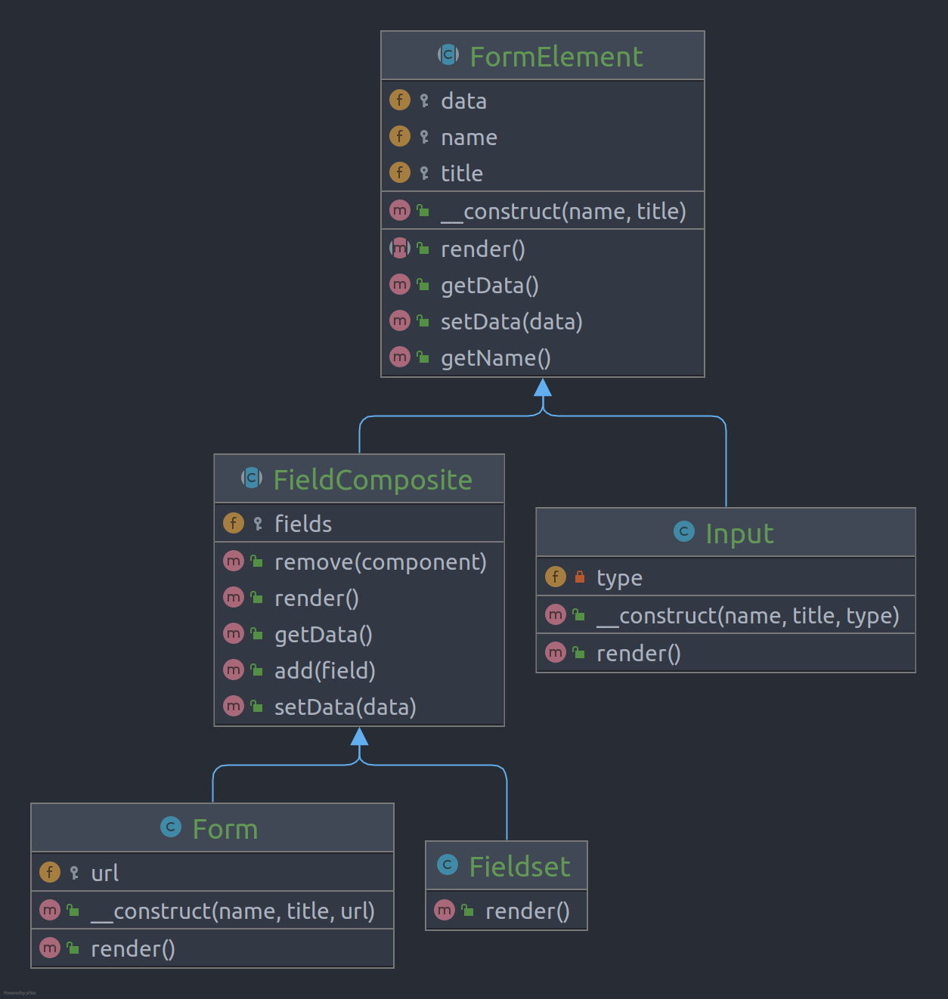

# Composite

**Composite** (Also known as: Object Tree) is a structural design pattern that lets you compose objects into tree
structures and then work with these structures as if they were individual objects.

## Problem

Using the Composite pattern makes sense only when the core model of your app can be represented as a tree.

## Structure

## How to Implement

- Make sure that the core model of your app can be represented as a tree structure. Try to break it down into simple
  elements and containers. Remember that containers must be able to contain both simple elements and other containers.
- Declare the component interface with a list of methods that make sense for both simple and complex components.
- Create a leaf class to represent simple elements. A program may have multiple different leaf classes.
- Create a container class to represent complex elements. In this class, provide an array field for storing references
  to sub-elements. The array must be able to store both leaves and containers, so make sure it’s declared with the
  component interface type.
- While implementing the methods of the component interface, remember that a container is supposed to be delegating most
  of the work to sub-elements.
- Finally, define the methods for adding and removal of child elements in the container.
- Keep in mind that these operations can be declared in the component interface. This would violate the Interface
  Segregation Principle because the methods will be empty in the leaf class. However, the client will be able to treat
  all the elements equally, even when composing the tree.

# Real World Example

The **Composite** pattern can streamline the work with any tree-like recursive structures. The HTML DOM tree is an
example of such a structure. For instance, while the various input elements can act as leaves, the complex elements like
forms and fieldset play the role of composites.

Bearing that in mind, you can use the Composite pattern to apply various behaviors to the whole HTML tree in the same
way as to its inner elements without coupling your code to concrete classes of the DOM tree. Examples of such behaviors
might be rendering the DOM elements, exporting it into various formats, validating its parts, etc. With the Composite
pattern, you don’t need to check whether it’s the simple or complex type of element before executing the behavior.
Depending on the element’s type, it either gets executed right away or passed all the way down to all element’s
children.

