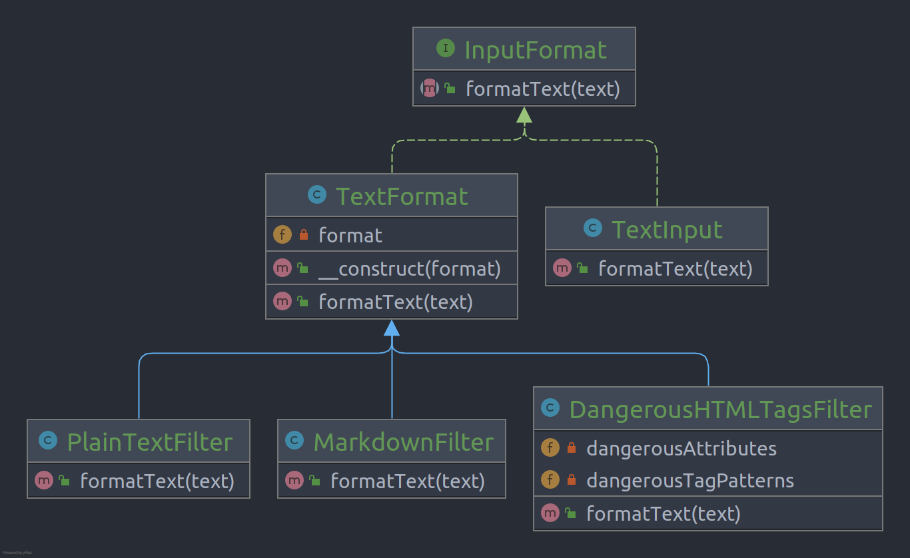

# Decorator

**Decorator** is a structural design pattern that lets you attach new behaviors to objects by placing these objects
inside special wrapper objects that contain the behaviors.

## Problem

Suppose you have a program could use the notifier class to send notifications about important events to a predefined set
of emails, but you want to extend it to have SMS or Slack notification! one of the solution for each notification type
is implementing a notifier’s subclass. but if you want to add new notification type and combinatorial of subclasses
maybe become too complicated 

## Structure

## How to Implement

- Make sure your business domain can be represented as a primary component with multiple optional layers over it.
- Figure out what methods are common to both the primary component and the optional layers. Create a component interface
  and declare those methods there.
- Create a concrete component class and define the base behavior in it.
- Create a base decorator class. It should have a field for storing a reference to a wrapped object. The field should be
  declared with the component interface type to allow linking to concrete components as well as decorators. The base
  decorator must delegate all work to the wrapped object.
- Make sure all classes implement the component interface.
- Create concrete decorators by extending them from the base decorator. A concrete decorator must execute its behavior
  before or after the call to the parent method (which always delegates to the wrapped object).
- The client code must be responsible for creating decorators and composing them in the way the client needs.

# Real World Example

In this example, the **Decorator** pattern helps you to construct complex text filtering rules to clean up content before
rendering it on a web page. Different types of content, such as comments, forum posts or private messages require
different sets of filters.

For example, while you’d want to strip out all HTML from the comments, you might still want to keep some basic HTML tags
in forum posts. Also, you may want to allow posting in Markdown format, which shall be processed before any HTML
filtering takes place. All these filtering rules can be represented as separate decorator classes, which can be stacked
differently, depending on the nature of the content you have.

