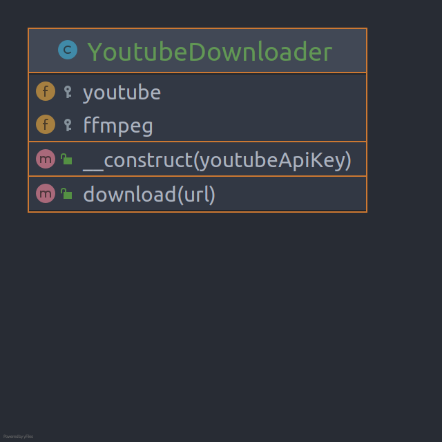

# Facade

**Facade** is a structural design pattern that provides a simplified interface to a library, a framework, or any other
complex set of classes.

## Problem

Imagine that you must make your code work with a broad set of objects that belong to a sophisticated library or
framework. Ordinarily, you’d need to initialize all of those objects, keep track of dependencies, execute methods in the
correct order, and so on.

As a result, the business logic of your classes would become tightly coupled to the implementation details of 3rd-party
classes, making it hard to comprehend and maintain.

## Structure

## How to Implement

- Check whether it’s possible to provide a simpler interface than what an existing subsystem already provides. You’re on
  the right track if this interface makes the client code independent of many of the subsystem’s classes.
- Declare and implement this interface in a new facade class. The facade should redirect the calls from the client code
  to appropriate objects of the subsystem. The facade should be responsible for initializing the subsystem and managing
  its further life cycle unless the client code already does this.
- To get the full benefit from the pattern, make all the client code communicate with the subsystem only via the facade.
  Now the client code is protected from any changes in the subsystem code. For example, when a subsystem gets upgraded
  to a new version, you will only need to modify the code in the facade.
- If the facade becomes too big, consider extracting part of its behavior to a new, refined facade class.

# Real World Example

Think of the **Facade** as a simplicity adapter for some complex subsystem. The **Facade** isolates complexity within a
single class and allows other application code to use the straightforward interface.

In this example, the **Facade** hides the complexity of the YouTube API and FFmpeg library from the client code. Instead
of working with dozens of classes, the client uses a simple method on the Facade.

