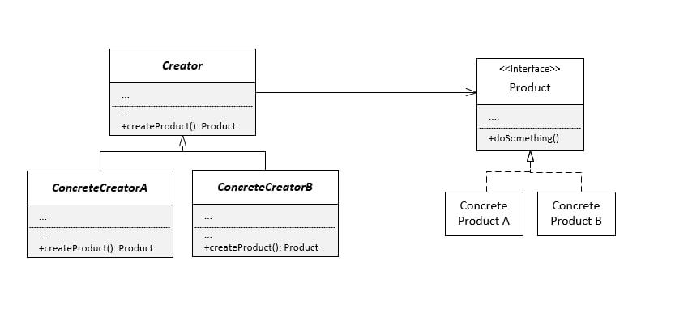
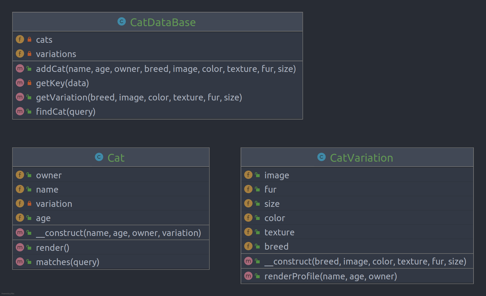

# Proxy

**Proxy** is a structural design pattern that lets you provide a substitute or placeholder for another object. A proxy
controls access to the original object, allowing you to perform something either before or after the request gets
through to the original object.

## Problem

Suppose you have an object that is expensive to use — it opens a network connection, reads a large file, or consumes a
lot of memory — but you only need it some of the time. You could add lazy initialisation or caching directly to that
class, but then every client pays for that code, and the class stops doing just one thing.

You also can't always edit the class: it may come from a third-party package. The Proxy pattern lets you place a
stand-in object with the *same interface* in front of the real one, so clients keep working unchanged while the proxy
adds the caching, logging or access control around it.

## Structure

## How to Implement

- If there’s no pre-existing service interface, create one to make proxy and service objects interchangeable. Extracting
  the interface from the service class isn’t always possible, because you’d need to change all of the service’s clients
  to use that interface. Plan B is to make the proxy a subclass of the service class, and this way it’ll inherit the
  interface of the service.
- Create the proxy class. It should have a field for storing a reference to the service. Usually, proxies create and
  manage the whole life cycle of their services. On rare occasions, a service is passed to the proxy via a constructor
  by the client.
- Implement the proxy methods according to their purposes. In most cases, after doing some work, the proxy should
  delegate the work to the service object.
- Consider introducing a creation method that decides whether the client gets a proxy or a real service. This can be a
  simple static method in the proxy class or a full-blown factory method.
- Consider implementing lazy initialization for the service object.

# Real World Example

There are countless ways proxies can be used: caching, logging, access control, delayed initialization, etc. This
example demonstrates how the Proxy pattern can improve the performance of a downloader object by caching its results.

`SimpleDownloader` is the real service: every call costs a round trip. `CachingDownloader` is the proxy — it implements
the same `Downloader` interface, so clients can't tell the difference, but it only delegates on a cache miss. Repeated
requests for the same URL are served from memory.

